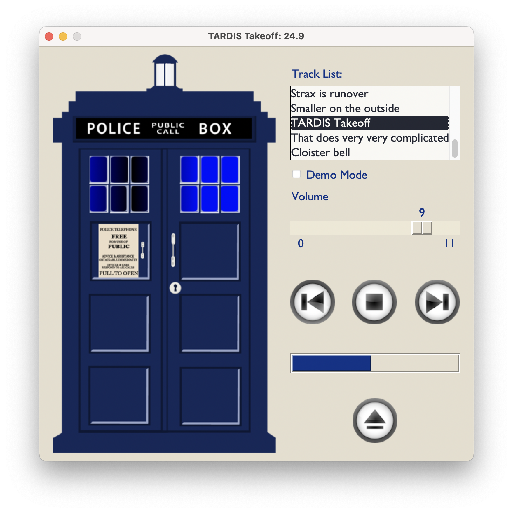

# pyTardis
## A demo Python project using PySimpleGUI, PIL and VLC
### Background
Some time ago, as an Arduino and 3D printing hobbyist, I created a model of the *Doctor Who*
**TARDIS** with flashing LEDs and a speaker playing short clips from the show.
Some day I expect to make a GitHub project detailing how I made it, but in the meantime
you can see a video of it in operation on [YouTube](https://www.youtube.com/watch?v=9Ehs3DSArC4).

In order to further my understanding of Python in general, and to possibly create a "prototyping"
mechanism for further updates to the Arduino code, I created this project. This involved using
several packages to:

- Display a GUI (`PySimpleGUI`)
- Create and display animated images (`Pillow`)
- Play sounds (`python-vlc`)
- package it all up for publication (GitHub, MarkDown)

I had already written several utilities for myself with minimal UIs using PySimpleGUI (and
this application isn't that complicated, either) so I stayed with that package for the UI.

I was having difficulty creating and using animated GIFs for the UI, so I dug into
Pillow for file creation and display. The end result was not 100% satisfactory: both Pillow
and `tkinter` (which PySimpleGUI relies upon) have a history of issues with transparent GIFs,
so I went the "animated PNG" (APNG) route. The `AnimatedImage` class included here was
created to access the individual frame durations availble in both GIF and APNG for slightly
more nuanced animations, and to possibly use the "default image" specified for APNG
(which I implemented with duration=0 initial frames) for items like GUI image buttons
that are static until clicked. I originally tried to simply hook into the `PySimpleGUI.Image`
members for this, but then went completely separate from it in case things change under the
covers.

For the audio, I investigated numerous Python sound packages. Many offered limited sound
file format support (.wav only), blocked the GUI while playing, or couldn't stop a song while
playing. The first workable package I used was `PyObjC` and `NSSound` for macOS which
supports a callback when a track has finished, but of course this isn't cross-platform.
I ended up using the `python-vlc` package since I already had
the VLC player installed on my machine, and was able to simply "poll" the player code in my
PySimpleGUI timeout handler.

## Operation

The application is very straight-forward. The buttons will: switch to the previous track,
play the curren track (or stop the current track if it is already playing), go to the next
track, or exit the program. The track list may be clicked on to select a specific clip.

The volume may be changed with the slider[^1].
Note this is moderated by your system's sound system settings: full volume is just your
normal desktop level; all lower values are quieter than normal.

Clicking on "Demo Mode" will cause the tracks to play continuously in succession.

## The code

This code requires the Python packages listed in the `requirements.txt` file. It also
requires that the VLC Media Player application be installed on your machine.

- tardis.py - the "main" script with the PySimpleGUI event loop; drives the whole app.
- tracks.py - "data" file that lists the sound clips and their associated animations.
- tardis_controller.py - called from the GUI to control audio and animations from the
`tracks` list.

- video_player.py - animates the TARDIS, which is actually 2 PySimpleGUI.Image elements
(the beacon and the TARDIS body windows) based on the `tracks` settings. I could have
split his into 3 parts (beacon, windows and static body), but I was getting RSI re-editing
images in my photo editor.

- animated_image.py - updates PySimpleGUI.Image elements to displaay the animation frames.
- audio_player.py - uses the VLC player to play the `tracks`-specified sound files. 
- timed_print.py - utility class that can be used to prefix print output with "ss:mmm".
- images/* - contains all the static and animated images used (and some unused ones, too).
- audio/* - contains all the sound files played.

I spent ("wasted") a lot of time learning how to edit images to replicate the LED
animations in my model, as well as creating several styles of media control buttons.
The results, as well as a number of hacky scripts to "auto-generate" some files, are
not included in the repository. References to an "./imagery" folder in test secitons
of code may still be present.

[^1]: "_These_ go to eleven" - _This is Spinal Tap_
